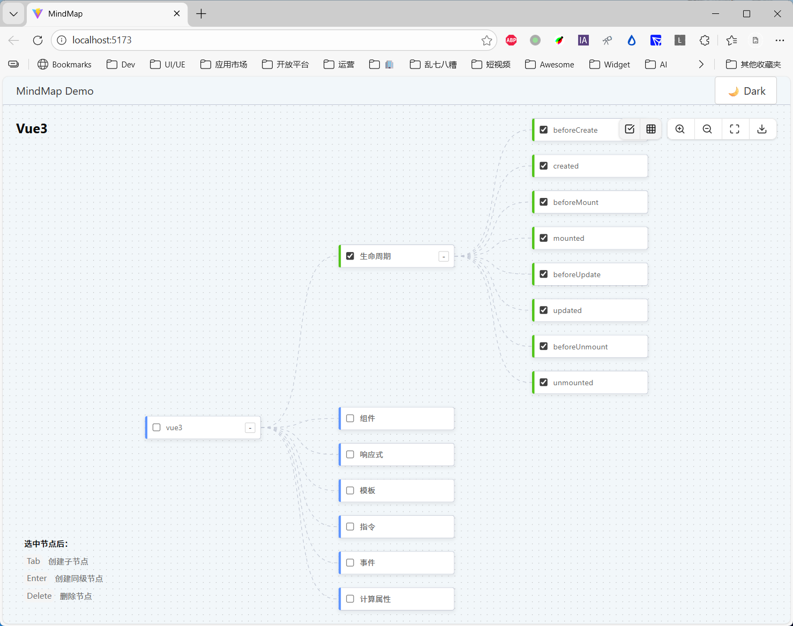

# @widget-js/mindmap

A React MindMap component using AntV X6.



## Installation

```bash
npm install @widget-js/mindmap
# or
pnpm add @widget-js/mindmap
# or
yarn add @widget-js/mindmap
```

## Usage

```tsx
import type { MindNode } from '@widget-js/mindmap'
import { MindMap } from '@widget-js/mindmap'
import { useState } from 'react'

const data: MindNode = {
  id: 'root',
  name: 'Root Node',
  children: [
    {
      id: 'child1',
      name: 'Child 1',
    },
    {
      id: 'child2',
      name: 'Child 2',
    },
  ],
}

function App() {
  const [isDarkMode, setIsDarkMode] = useState(false)

  return (
    <div style={{ height: '100vh', width: '100%' }}>
      <MindMap
        data={data}
        title="My MindMap"
        isDarkMode={isDarkMode}
        onNodeChange={(newData, type) => {
          console.log('Node changed:', type, newData)
        }}
      />
    </div>
  )
}
```

## Props

| Prop | Type | Default | Description |
| --- | --- | --- | --- |
| `data` | `MindNode` | Required | The data structure for the mind map. |
| `title` | `string` | `'思维导图'` | The title displayed in the top left corner. |
| `isDarkMode` | `boolean` | `false` | Controls the theme of the mind map. |
| `readonly` | `boolean` | `false` | If true, editing is disabled. |
| `onNodeChange` | `(data: MindNode, type: string) => void` | - | Callback triggered when nodes are changed. |

## Data Structure (MindNode)

```typescript
interface MindNode {
  id: string
  name: string
  type?: string
  checked?: boolean
  url?: string
  collapsed?: boolean
  children?: MindNode[]
}
```

## Keyboard Shortcuts

When a node is selected:

- `Tab`: Create a child node.
- `Enter`: Create a sibling node.
- `Delete`: Delete the selected node.
